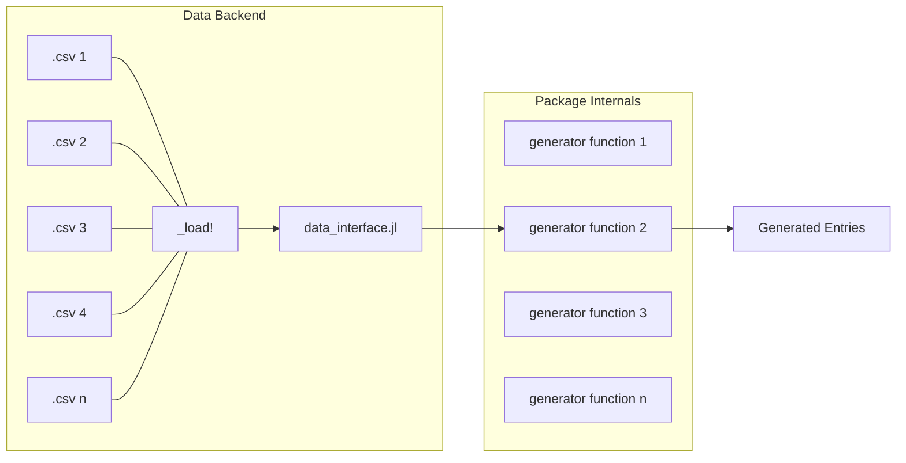

# Developer Guide

This guide aims to provide a general overview of the internals of Impostor.jl. Some of the topics
covered in this page are:
- High-level view of the functionality segregation.
- Organization of data files used to generate the entries.
- How to add new data to the package.
- How to implement new generator-functions.

## Design and Structure

Impostor doesn't magically generates valid names, street names, addreses or credit card numbers
out of thin air, of course. Its generation process is based on the information contained in several
`.csv` files structured according to which provider, content and locale each data refers to.

Roughly speaking, when a user calls the generator function `states(["BRA", "USA"], 20; level = :country_code)`
Impostor will internally fetch `.csv` data files with information about country codes and states,
apply the appropriate filters and return correct number of generated entries respecting the
restrictions imposed during the call of `states`.

The following figure depicts the data-flow process as a user requests the generation 



The steps performed in this generation process can be broken down in two main "components":
- **Data Backend**: responsable for *lazily loading* the contents, ensuring consistency between the requests and maintaining the structure of the data archive. It is also its responsability to verify the existance of the requested data files erroring when they are not available.
- **Package Internals**: serves as a client for the data backend, this component is responsible selecting the appropriate data files to be loaded and manipulate their contents to comply with the generator-function call restrictions when applicable (*e.g.* option-based or mask-based loading).

## Archive Organization

The information contained in each of the `.csv` files is read into a `DataFrame` and stored in an
internal structure *vaguely* called `DataContainer`. This `struct` encapsultes a list of currently
selected locales for the Session Locale and a dictionary with sub-directories pointing to loaded
DataFrames containing data consumed by the generator functions. The key-value structure used by
this dictionary matches the organization of the `.csv` files under the `src/data/` directory as follows:

```
src/data/
    <provider>/
        <content>/
            HEADER.txt
            en_US.csv
            pt_BR.csv
            ...
            en_UK.csv
```

In the structure above:
- `provider` encapsulates the associated *Provider*, *e.g.* Localization
- `content` stores the `.csv` files for a given *Content*, *e.g.* state codes. Each `.csv` content file is named after the locale it refers to.
- `HEADER.txt` is a text file storing exclusively names of columns for all files stored in the `src/data/<provider>/<content>/` directory, one column name per line. This file ensures column naming consistency across all locales and prevents individual files from needlessly repeating the same column names. For that reason, every `.csv` file **must contain only the associated *data*, leaving headers for the respective `HEADER.txt` files**.

The interface between the data file structure shown above and the generator functions is stablished
by the [`Impostor._load!`](@ref) method, which serves as a single point of access to all information
stored in the `src/data/` directory. When a generator-function internally calls

```julia
Impostor._load!("localization", "state", "en_US")
```

the structured archive is checked for the existance of a `"state"` *content* in the `"localization"`
*provider* associated to the United States english (`"en_US"`) *locale*. If such file is available,
a `DataFrame` object is returned with the associated data for further manipulation. Since the column
names for a given (`"localization"`, `"state"`) tuple are garanteed to be equal by design, multiple
locales may be loaded at once:

```julia
Impostor._load!("localization", "state", ["en_US", "pt_BR"])
```

!!! note "Note on Implementation"
    The [`Impostor._load!`](@ref) is designed in such way that **the DataFrames loaded in each
    interaction with the archive are memoized** to prevent reading the same information more than
    once per session. This functionality is aided by the functions present in the
    [Utility Function](utilities/utility_functions.md) page.

## Adding New Data

In order to add new data files, contents or providers, carefully follow the same directory structure
described in the previous section paying attention to the format of the `HEADER.txt` file. Some of
the scenarios you will find while adding new data to the archive are shown below:
- **Incrementing existing locale files**: corresponds to the simplest case, just add new rows to the respective `.csv` file. Typically, to ease navigation for users adding new data, the `.csv` are usually sorted by some of its columns, make your changes so that this property remains valid in the modified file.
- **Adding new contents or providers**: in both cases the creation of a new directory/set of directories is needed. Although this my be slightly subjective, try to do it so that the new set of directories resambles the current organization structure in `data/` (when in doubt reach out via GitHub so we can discuss the best organization for the files).
    - Make sure that a set of unit tests exist for the new content in order to ensure its consistency, place the implementation under the `tests/data_integrity/` directory in a file called `test_<your provider>.jl`
    - If your data requires any kind of restriction (*e.g.* a certain column may only contain a restricted set of values), register such restrictions in the `src/relation_restrictions.jl` file.

## Adding New Functions

Some guide-lines on adding new generator-functions are:
1. Make sure that that contents required for the new generator-function are available under the data archive in `src/data/`. If not, then proceed to the previous section on adding new data.
1. Use *exclusively* the [`Impostor._load!`](@ref) function to interact with the data archive. In order to manipulate the dataframe(s) according to your needs, the functions exported by [DataFrames.jl](https://dataframes.juliadata.org/stable/lib/functions/) should suffice most use cases. If you need other package(s) to manipulate the dataframes in order to get the desired output, file an issue explaining the situation and we will discuss the addition of a new dependency.
1. Add the new generator-function to the `export` list in the `src/Impostor.jl` in the appropriate Provider grouping. Make sure to add it in alphabetical order in each group.
1. Add docstrings with examples, when possible/applicable.

## Testing Philosophy

Tests in Impostor are split in two categories: *implementation correctness* tests (the usual case for
virtually all unit-tested codebases); and *data integrity* tests which ensure that properties of 
data in each `.csv` are respected for each locale, content and provider. In this context, the testing
philosophy used by this package is that:

> If the contents of datafiles are exhaustively tested for consistency, then testing generator-functions becames a matter of ensuring output formatting correctness.

In this context, *testing for consistency* means that some set of validations is performed upon the
files in `src/data/` expecting to verify if the newly added data produces any unexpected behavior
on the generator-function side of things.
